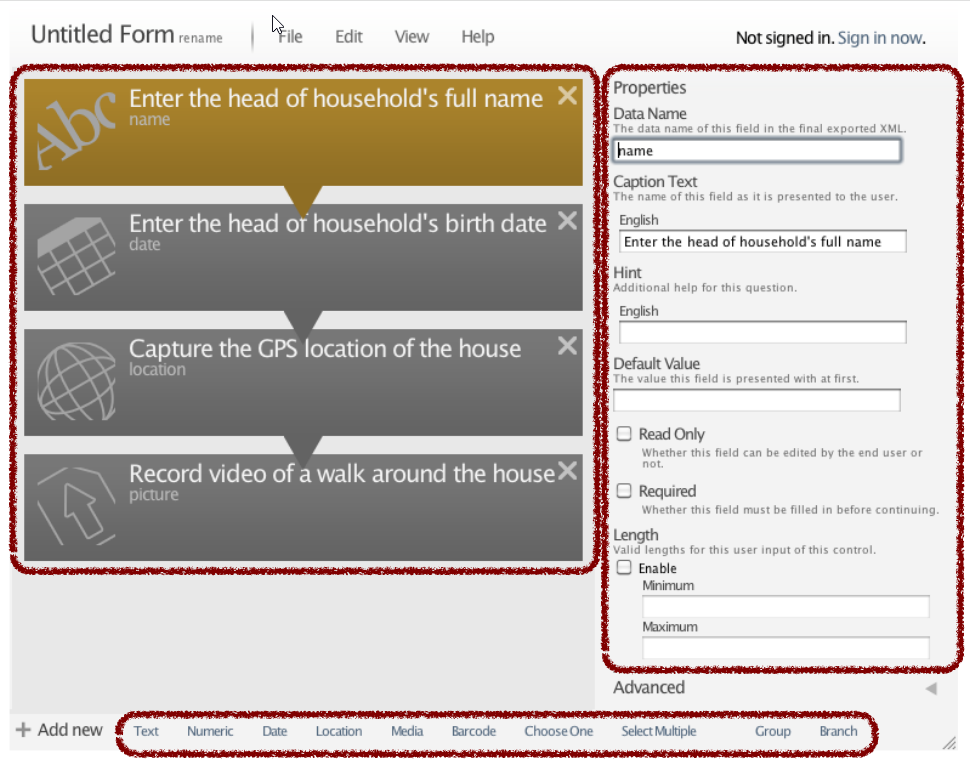
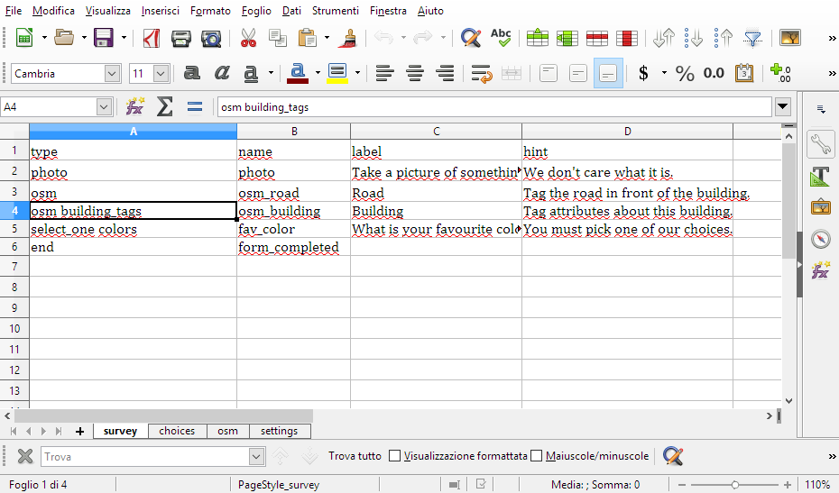
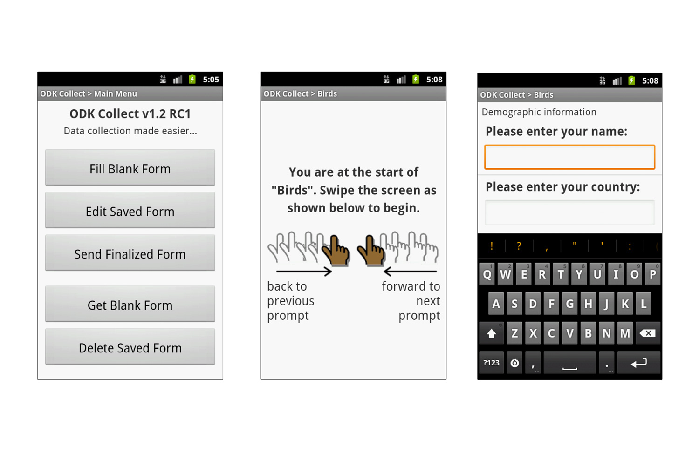
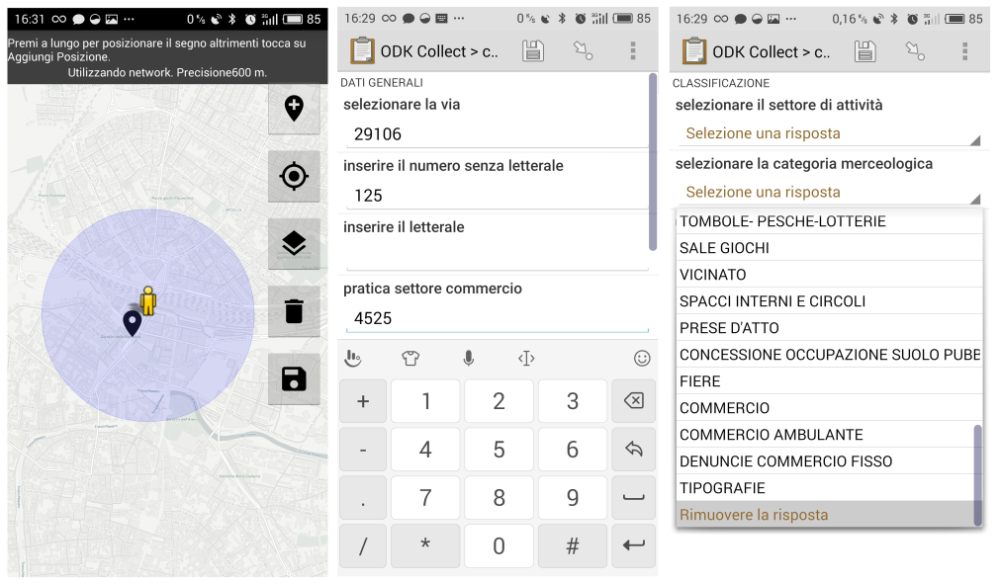
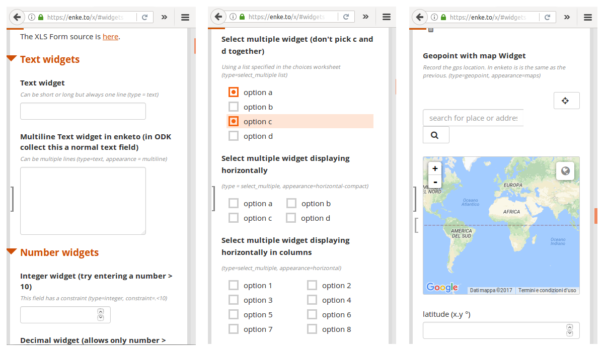
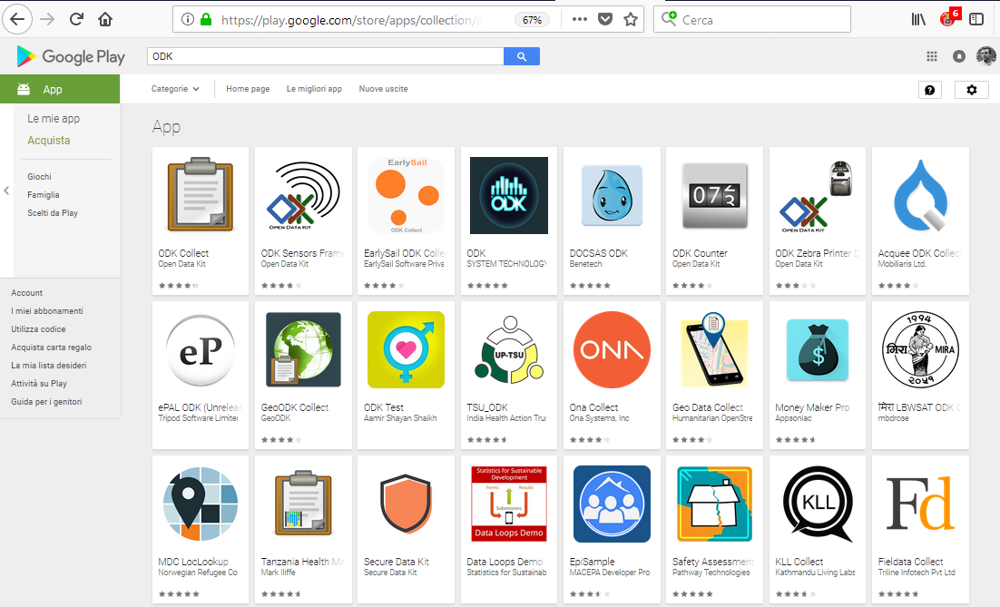
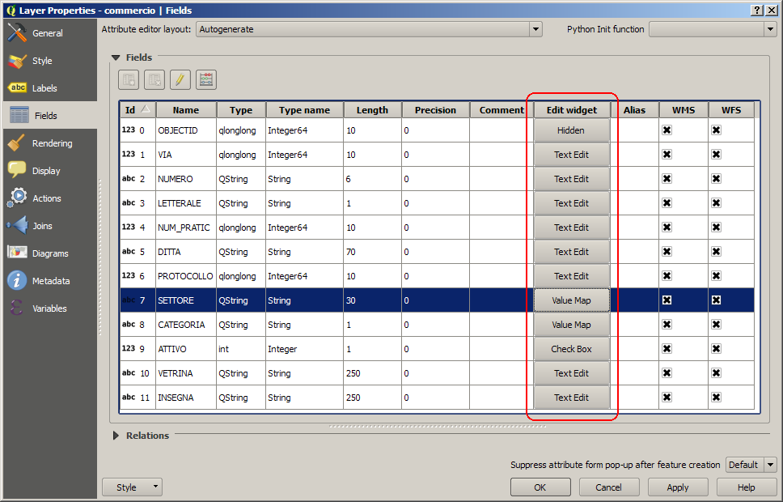
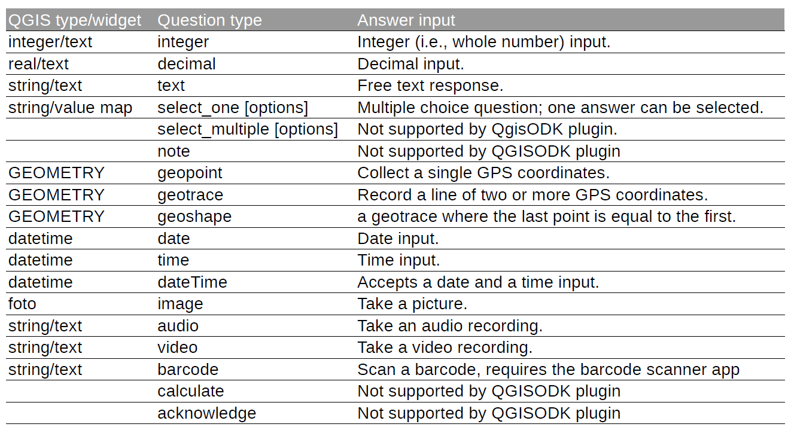
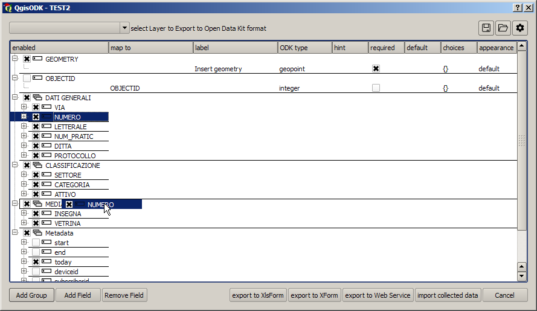
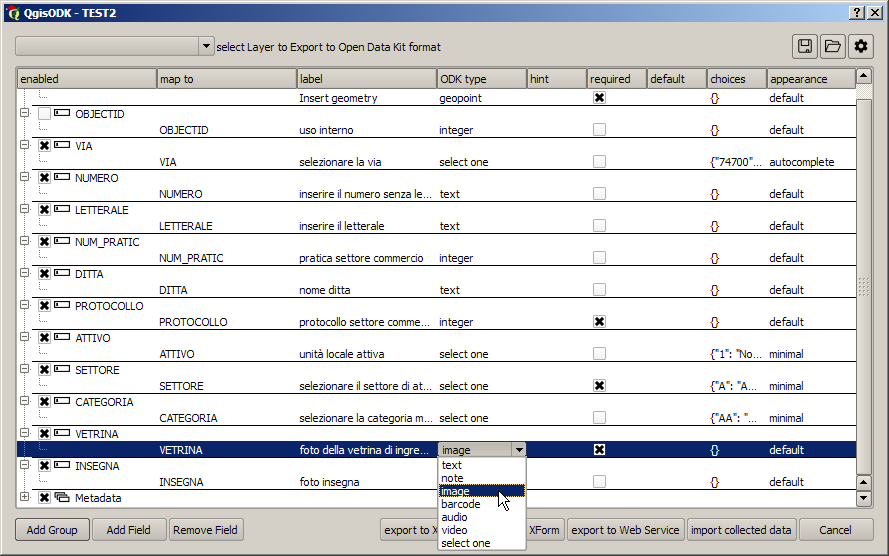

# QgisODK

FOSS4G Italia 2018 - ROMA

Raccolta in loco di informazioni a contenuto geospaziale con Open Data Kit (ODK) e QGIS

Enrico Ferreguti – enricofer@gmail.com

https://opendatakit.org/

https://github.com/enricofer/QgisODK/

---

# indice

1. [Introduzione a ODK](#/2)
1. [Progetto delle informazioni (build)](#/3)
1. [Raccolta dati (collect)](#/4)
1. [Aggregazione delle informazioni (aggregate)](#/5)
1. [i dati geospaziali in ODK](#/6)
1. [Strumenti di integrazione con il GIS](#/7)
1. [procedure di integrazione tra ODK aggregate e postgis](#/8)
1. [Il plugin QgisODK](#/9)
1. [Materiali del workshop](#/10)

---

## ODK

- E’ sviluppato dall’università di Seattle
- E’ completamente basato su strumenti e tecnologie opensource
- E’ finalizzato a:
  - Raccogliere informazioni in modo semplice con l’ausilio di dispositivi mobili, anche in mancanza di connessioni stabili di rete
  - Aggregare le informazioni raccolte da molti utenti e pubblicarle
- [Esempi di utilizzo](https://forum.opendatakit.org/c/showcase)

--

## Come si utilizza

- Un indagine ODK è tipicamente basata sulle seguenti attività:
  - Progetto delle informazioni da raccogliere  (build)
  - Raccolta dei dati sul campo (collect)
  - Aggregazione dei dati raccolti (aggregate)
- ODK non è un applicazione, ma un ecosistema di applicazioni orientare a queste attività

--

## Il Flusso ODK

---

## Progetto delle informazioni
## (build)

- Le informazioni da raccogliere sono organizzate in moduli secondo lo standard [Xform](https://en.wikipedia.org/wiki/XForms) (XML)
- Per la progettazione della form, ODK mette a disposizione lo strumento build: https://build.opendatakit.org/
- In alternativa il contenuto informativo può essere definito con un XlsForm, ovvero un foglio di excel opportunamente compilato traducibile in Xform. http://xlsform.org/

--

## Xform con ODK build

--

## Xform da XlsForm

- Foglio di excel ha dei contenuti minimi obbligatori ed altri opzionali
- Contenuti minimi obbligatori:
  - Foglio survey con almeno 3 colonne: type, name, label
- Altri contenuti:
  - Foglio choices per campi categorizzati
  - Foglio settings per settaggio personalizzati del foglio
  - Altre colonne opzionali nel foglio survey (constraint, appearance, etc) con cui guidare l’inserimento delle informazioni

--

## Xform da XlsForm

---

## Raccolta dati
## (collect)

- La raccolta dati viene effettuato con un dispositivo mobile senza la necessità di connessione di rete
- La raccolta avviene in tre fasi:
 - Scelta del modulo dati da compilare
 - Compilazione delle rilevazioni (entries)
 - Sincronizzazione delle rilevazioni sul server di aggregazione
- Gli strumenti ad disposizione sono:
 - ODK collect (android app) google play store
 - Enketo webapp https://enketo.org/

--

## ODK collect app

--

## Raccolta dati con ODK collect

--

## Enketo webapp

--

## Altre apps

---

## Aggregazione delle informazioni
## (aggregate)

- Le informazioni raccolte nei dispositivi mobili vengono trasferiti al server di aggregazione in presenza di connesione di rete
- Ad ogni modulo corrisponde un record nel server di aggregazione
- Nel server di aggregazione risiedono anche i modelli Xform dei moduli di compilare e viene mantenuta la relazione tra modulo e database

--

## Server di aggregazione

Applicazioni:
- Odk aggregate: https://opendatakit.org/use/aggregate/ [VM](http://192.168.56.101)
- Formhub: https://github.com/SEL-Columbia/formhub
Servizi:
- Google Drive
- Ona.io
- Formhub (American Red Cross)
- surveyCTO

---

## i dati geospaziali in ODK

- (build) - i tipi geospaziali in ODK
 - geopoint
 - geotrace
 - geoshape

- (collect) - il campo localizzazione
 - default
 - maps
 - placement map

- (aggregate) - restituzione dei dati geografici

--

## (build) - i tipi geospaziali in ODK

- geopoint: corrisponde alla geometria punto espressa in latitudine e longitudine, altezza e precisione
- geotrace: corrisponde alla geometria linea espressa in successione di geopoint
- geoshape: corrisponde alla geometria poligono espressa in successione di geopoint con il punto finale uguale al punto iniziale

--

## (collect) - il campo localizzazione

i campi definiti come tipi geospaziali nella XForm sono gestiti dall'applicazione geospaziale a seconda del tipo geospaziale ed a seconda dell'aspetto ('appearance') stabilito nella Xform. I tipi di aspetto sono i seguenti:

- default: per i geopoint l'applicazione si mette in attesa del punto gps senza mostrare nessuna mappa, mentre per geotrace e geoshape corrisponde a maps
- maps: compare una mappa predefinita su cui è possibile verificare l'attuale localizzazione ed effettuare i campionamenti usando la posizione indicata dal GPS del dispositivo
- placement map: compare una mappa su cui è possibile indicare manualmente la posizione da rilevare

--

## (aggregate) - restituzione dei dati geografici

- I dati a contenuto geospaziale di tipo geopoint sono costituita da quattro numeri separati da spazi:
 - 45.35214524585178 11.1676025390625 27.0 15.0 che corrispondono a (latitudine longitudine altezza precisione)
- I dati geotrace sono costituiti da successioni di geopunti separati da ";" (punto e virgola)
- I dati geoshape sono geotrace con il punto finale coincidente con quello iniziale

--

#### ODK e GIS

- punti di forza:
 - rilevazione sul campo senza infrastruttura di rete
 - possibilità di personalizzare l'interfaccia di rilevazione
 - possibilità di personalizzare le mappe di base con mappe offline esportate in [mbtiles](https://forum.opendatakit.org/t/role-of-the-layers-folder-in-odk-collect/10168/6?u=ln)

- punti di debolezza
 - scarsa integrazione con le sorgenti dati esistenti
 - i dati non standard hanno bisogno ulteriore decodifica
 - la posizione geografica deve essere riproiettata
 - i dati non sono di immediato riutilizzo
 - non si presta alla manutenzione dei dati

---

## integrazione con il GIS

- strumenti di integrazione tra ODK aggregate e postgis
 - integrazione a livello database tra le tabelle di ODK aggregate e tabelle in Postgis/Postgresql.
 - I dati raccolti sono cartografati in tempo reale.

- plugin QgisODK
 - integrazione a livello applicativo di ODK con altre sorgenti di dati geografiche supportate da QGIS.
 - Consente di automatizzare il processo di creazione della form di raccolta e la sincronizzazione con le sorgenti dati esistenti.

---

## procedure di integrazione tra ODK aggregate e postgis

- Autore: mathieu.bossaert@cenlr.org, Conservatoire d'espace naturels Laguedoc-Roussilion
  [Web](http://si.cenlr.org/geoodk_sicen_mobile) / [Repository](https://framagit.org/mathieubossaert/formation_odk/wikis/cote-base-de-donnee)

- La procedura permette di aggiornare in modo automatico, alla registrazione di una submission su odk aggregate, il sistema informazione naturalistica dell'ente. 
- permette una stretta integrazione tra sistemi di raccolta e rappresentazione cartografica, ma è molto legata al database ed alla struttura del dataset

---

## Il plugin QgisODK

- plugin di QGIS
- Generazione semiautomatica del il modulo XForm a partire dalla proprietà del layer sorgente di QGIS adattando i tipi di dati/widget di QGIS ai tipi ODK
- Riorganizzare i campi per la raccolta in loco
- Multipiattaforma di aggregazione (attualmente ODK aggregate, Google Drive e ona.io)
- Trasferire i moduli  ad una piattaforma ODK
- Sincronizzare i dati raccolti con il layer sorgente

--

## I  “field widgets” di QGIS

--

## I tipi ODK 1

--

## Riorganizzazione dei campi

--

## La finestra di dialogo principale

--

## Esportazione dei moduli

- Il modulo di raccolta dati può essere trasferito ad un servizio remoto di aggregazione o caricato manualmente sul dispositivo mobile sotto forma di file XML
- I servizi aggregazione attualmente riconosciuti dal plugin sono il server ODK aggregate, ona.io (gratuito con registrazione) e google drive
- Altri servizi di aggregazione possono essere usati generando un file XlsForm (SurveyCTO ODK aggregate)

--

## Servizi di aggregazione supportati

- [ODK aggregate](https://github.com/enricofer/QgisODK/blob/master/README.md#7-qgisodk-and-odk-aggregate): inserire URL del server e credenziali di accesso in scrittura
- [Google Drive](https://github.com/enricofer/QgisODK/blob/master/README.md#6-qgisodk-and-google-drive): inserire email di Google con autenticazione oauth2 alla connessione al servizio (servizio di notifica dei partecipanti alla raccolta dati)
- [ona.io](https://github.com/enricofer/QgisODK/blob/master/README.md#5-qgisodk-and-onaio): inserire codice di progetto di ona e credenziali di accesso al servizio

--

## Sincronizzazione dati raccolti/layer sorgente

- I dati raccolti con ODK collect e trasferiti al servizio di aggregazione possono essere importati in QGIS come nuovo layer o sincronizzati
nel layer sorgente
- È possibile mappare i campi importati su campi del layer di destinazione [indicando opportunamente i layer di destinazione](https://github.com/enricofer/QgisODK/blob/master/README.md#8-importing-collected-data)
- Scaricamento degli allegati

--

## Sviluppi

- Aggiunta di nuovi servizi di aggregazione
- Estensione del supporto ai tipi ODK
- Gestione dei default data
- Gestione dei vincoli
- Generazione di mbtiles per mappe offline

---

## Materiali del workshop

- [Dataset di esempio](https://github.com/enricofer/odk_qgis_workshop_foss4gisIT/tree/master/dataset)
- [Odk aggregate su macchina virtuale locale](http://192.168.56.101)
- [Cartella condivisa su Google drive](https://drive.google.com/drive/folders/1AFQwPnO7eMTS96a7sQ4bs7KdRvvVa2-2?usp=sharing)
- [progetto su ona.io](https://ona.io/foss4gisworkshop/53629)

--

## Attivita del workshop

1. definizione in QGIS della struttura dei dati da rilevare dati
1. raggruppamento e specificazione del modulo di raccolta 
1. predisposizione dei servizi di aggregazione
 - odk aggregate, gdrive, ona.io
1. configurazione dei servizi di aggregazione
 - odk aggregate, gdrive, ona.io
1. upload del modulo al servizio di aggregazione
1. raccolta dei dati sul campo
1. download delle form submission e sincronizzazione con il dataset esistente
